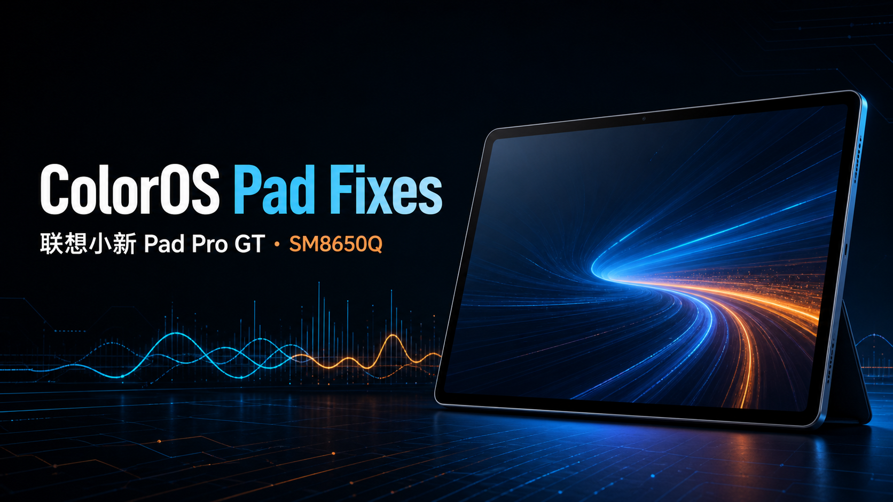

<p align="center">
  
</p>

# ColorOS Pad Fixes

联想小新 Pad Pro GT（**TB710FU** / SM8650Q / pineapple）运行 ColorOS 16 移植系统（OPD2513）的适配修复项目。

[](#兼容性)
[](#兼容性)
[](../../releases/latest)
[](#许可证与第三方材料)

项目以配套内核、KernelSU 模块和 LSPosed Hook 补齐移植系统的硬件适配、框架兼容与外设桥接。

> [!WARNING]
> **3.x 必须先刷同一 Release 的 `boot` 与 `vendor_boot`，再安装模块。** 两个镜像必须成对使用；缺少或混用版本会造成内核模块 ABI 不匹配，可能无法启动。
>
> 不希望刷分区时，请使用最后一个纯模块版本 [v2.0.15](../../releases/tag/v2.0.15)。它不包含 3.0.0 及之后的内核级、调度与内存扩展修复，也不再维护。

## 功能概览

- 系统适配：显示与环境光、144 Hz、性能/温控拓扑、内存与交换、音频与传感器链路。
- 相机与 AON：相机服务稳定性、前摄占用仲裁、AON 注视感知运行时兼容、物理前摄指示灯。
- 手写笔：BLE/HID 连接、电量与充电、磁吸状态、设备空间和触觉反馈桥接。
- 扩展能力：Scene 调度、OPlus BSP 内核模块、CryptoEng 查找设备/互传兼容、ZUI 原厂相机移植。

## 发布内容

| 文件 | 用途 | 安装要求 |
|---|---|---|
| `boot-ACLaniakea-*.img` | 配套 GKI 内核 | **必刷，先刷** |
| `vendor_boot-hyperSched-stub.img` | 配套 vendor_boot 与 hyperSched 桩 | **必刷，必须与 boot 成对** |
| `FixModule-*.zip` | 主修复模块 | **必装** |
| `BaseFix-Hook-*.apk` | 主修复的 LSPosed Hook | **必装** |
| `OplusBSP-Modules-*.zip` | 调度、压缩内存、后台冻结等 BSP 内核模块 | 完整 3.x 方案必装 |
| `PenBridge-Module-*.zip`、`PenBridge-Hook-*.apk`、`PenHidCtl-*.apk` | 手写笔桥接三件套 | 使用手写笔时安装 |
| `SM8650Q-Scene-Scheduler-*.zip` | Scene 省电/均衡/性能/极速调度配置 | 使用 Scene 时安装 |
| `CryptoengHAL-Module-*.zip` | 查找设备与一加互传联系人兼容 | 按需安装 |
| `LenovoPadProGT-ZUI-Camera-Port-*.zip`、`ZUI-Camera-Compat-*.apk` | TB710FU ZUI 原厂相机移植 | 按需安装 |

`base-fix/module` 与 `port-tuning` 是历史源码快照，**不要安装**；它们已合并至 `FixModule`。

## 前置条件

- 设备为 **TB710FU**，已安装 OPD2513 ColorOS 16 移植系统；
- bootloader 已解锁；
- 已安装 KernelSU 和 LSPosed（Zygisk）；
- `init_boot` 已按你的 KernelSU 方案修补。

本项目刷入的 `boot` 只提供配套内核，**不会安装或替代 KernelSU**。KernelSU LKM 位于修补后的 `init_boot`；刷写前请确认保留自己的 KernelSU `init_boot`。

## 安装

安装顺序固定为：**内核镜像 → KernelSU 模块 → LSPosed APK 与作用域 → 完整重启**。

### 1. 备份当前镜像

在系统中执行：

```bash
adb shell su -c 'dd if=/dev/block/by-name/boot_a of=/sdcard/boot_a.bak'
adb shell su -c 'dd if=/dev/block/by-name/vendor_boot_a of=/sdcard/vendor_boot_a.bak'
```

请将备份拉取到电脑或其他安全位置。

### 2. 成对刷入内核镜像

只使用同一 Release 中的一对镜像：

```bash
adb reboot bootloader
fastboot flash boot boot-ACLaniakea-6.1.128-13.img
fastboot flash vendor_boot vendor_boot-hyperSched-stub.img
fastboot reboot
```

不要只刷其中一个镜像，也不要将旧版模块与新版镜像混用。启动后可用以下命令确认内核版本：

```bash
adb shell uname -r
```

### 3. 安装 KernelSU 模块

在 KernelSU 管理器中安装以下模块，全部安装完成后再重启：

1. `FixModule-v3.2.0.zip`
2. `OplusBSP-Modules-v3.2.0.zip`
3. 按需：`PenBridge-Module-v3.2.0.zip`
4. 按需：`SM8650Q-Scene-Scheduler-v3.2.0.zip`
5. 按需：`CryptoengHAL-Module-v3.2.0.zip`
6. 按需：`LenovoPadProGT-ZUI-Camera-Port-v3.2.0.zip`

命令行安装示例：

```bash
adb push FixModule-v3.2.0.zip /sdcard/
adb shell su -c 'ksud module install /sdcard/FixModule-v3.2.0.zip'
```

### 4. 安装并启用 LSPosed 模块

```bash
adb install -r BaseFix-Hook-v3.2.0.apk
adb install -r PenBridge-Hook-v3.2.0.apk       # 使用手写笔时
adb install -r PenHidCtl-v3.2.0.apk            # 使用手写笔时
adb install -r ZUI-Camera-Compat-v3.2.0.apk    # 使用 ZUI 相机时
```

在 LSPosed 管理器中启用模块，并使用 APK 显示的**推荐作用域**。`FixModule` 会补齐必需作用域的白名单记录，但不会替代你在 LSPosed 中启用模块的操作。

基础修复的常用作用域包括 `android`、`SystemUI`、设置、AON、语音、手写笔与配件相关进程；ZUI 相机兼容 Hook 只应作用于 `com.zui.camera`。不要把 ZUI Hook 勾选到其他应用。

完成后执行**完整重启**，不要仅重启 zygote。

## 升级与回退

### 升级

1. 从同一 Release 下载全套镜像、模块和 APK。
2. 先成对刷入新的 `boot` 与 `vendor_boot`。
3. 覆盖安装模块和 APK。
4. 完整重启后再检查 KernelSU 与 LSPosed 状态。

### 回退

1. 优先进入 KernelSU 安全模式，停用最近安装的模块。
2. 如需回退内核，刷回自己备份的 `boot` 与 `vendor_boot`：

   ```bash
   fastboot flash boot boot_a.bak
   fastboot flash vendor_boot vendor_boot_a.bak
   ```

3. 仍无法恢复时，请参考 [刷机事故与救援手册](kernel-compat/刷机事故与救援手册.md)。

## 兼容性

| 项目 | 状态 |
|---|---|
| 联想小新 Pad Pro GT（TB710FU / SM8650Q / pineapple） | 支持 |
| ColorOS 16 移植系统 OPD2513 | 支持 |
| 其他联想设备、其他 SoC、原生 ZUI | 不支持 |
| ZUI 相机移植 | 仅限 TB710FU 的原厂相机资源 |

模块会检查目标平台；不匹配时跳过执行。仍请勿将本项目用于其他设备或 ROM。

## 常见问题

**需要全部安装吗？**

完整 3.x 方案需要配套镜像、主修复、BaseFix Hook 和 OPlus BSP。手写笔、Scene、CryptoEng、ZUI 相机均按需安装。

**可以不刷 boot/vendor_boot 吗？**

不可以。3.x 模块依赖配套内核提供的符号和接口；请改用 v2.0.15，或完整刷入同一 Release 的配套镜像。

**ZUI 相机是否替换底层相机 HAL？**

不会。ZUI 相机模块部署原厂相机应用及应用级兼容层；不替换 CamX、camera provider、内核驱动或全局设备身份。

**模块是否直接修改 system 或 vendor 分区？**

KernelSU 模块采用 systemless 挂载和运行时绑定，不改写 `system`、`vendor` 分区内容；但完整方案会明确刷写 `boot` 与 `vendor_boot`，两者不可混淆。

## 构建

构建产物输出至 `releases/`。SDK、签名文件、厂商镜像、原厂运行时和临时分析数据不随源码仓库分发。

```bash
export ANDROID_SDK=/path/to/android-sdk
export XPOSED_STUBS=/path/to/xposed-stubs
export ACL_KS=/path/to/signing-key.jks

bash tools/build_all.sh
```

各模块的构建入口位于相应目录的 `tools/` 中；内核模块、ABI 要求及构建说明见 [kernel-compat](kernel-compat/)。

## 文档

- [v3.2.0 发布说明](docs/3.2.0-release-notes.md)
- [v3.1.0 发布说明](docs/3.1.0-release-notes.md)
- [修复汇总与技术记录](修复汇总.md)
- [内核兼容性与后续移植说明](内核兼容性与后续移植说明.md)
- [主线 Linux 与 Arch Linux 可行性说明](主线Linux内核与ArchLinux启动可行性说明.md)

## 贡献与反馈

欢迎提交 Issue。请提供设备型号、ROM 与版本、已安装模块、复现步骤和必要日志；不要上传序列号、账号令牌、密钥或完整厂商固件。

## 免责声明

本项目仅供个人学习、设备适配与研究。刷机和 root 操作可能导致数据丢失、无法启动或失去保修；请自行评估风险并做好备份。

## 许可证与第三方材料

本项目作者编写的代码默认采用 [GPL-3.0](LICENSE)。`kernel-compat/` 中标注的内核模块源码采用 [GPL-2.0](kernel-compat/LICENSE)。

仓库或 Release 中可能包含用于兼容研究的第三方/原厂材料，例如联想 ZUI 相机 APK、配置、资源、签名关联内容、厂商二进制接口，以及从原厂或第三方实现观察到的 CryptoEng 协议字段和样本。这些材料不因随本项目分发而获得 GPL 再授权，相关权利仍归原权利人所有；本项目不授予复制、再分发、修改、商业使用或绕过设备、账号及服务安全机制的许可。使用者应自行确认拥有合法来源并遵守适用许可与法律。

CryptoEng 的分流、HKDF、AIDL 调用和互操作代码属于本项目代码并适用 GPL-3.0；厂商密钥材料、二进制、服务数据及其引用不在该授权范围内。

## 致谢

感谢所有测试者、上游开发者和开源社区的支持。

<p align="center">
  
</p>
